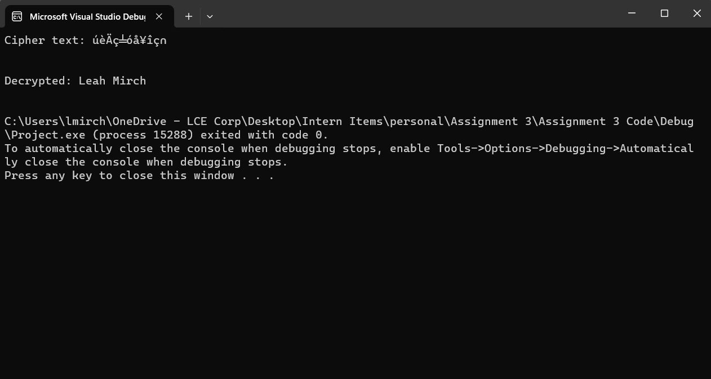

# 13490: Secure Cyber-Physical Systems Submition
## Student Name and Email
Atharva Tonape (athravtonape1072@gmail.com)

## Introduction
This project demonstrates basic assembly language programming using the Irvine Library. The program performs simple symmetric encryption and decryption using the XOR instruction. It showcases the use of assembly instructions to manipulate data and perform operations directly on hardware registers.

## Assembly Program Overview
### LeahMirch.asm
This file contains an assembly language program that:
- Defines a source string "Leah Mirch".
- Encrypts the string using a simple XOR-based encryption.
- Decrypts the string to retrieve the original text.
- Displays the encrypted and decrypted strings.

## Code Explanation
```assembly
INCLUDE Irvine32.inc

.data
    ; Define the source string and buffers for encryption and decryption
    sEncrypt BYTE "Cipher text: ", 0
    sDecrypt BYTE "Decrypted: ", 0
    buffer BYTE "Leah Mirch", 0
    bufSize DWORD LENGTHOF buffer
    KEY = 239 ; any value between 1-255

.code
main PROC
    ; Encrypt the buffer
    call TranslateBuffer

    ; Display encrypted message
    mov edx, OFFSET sEncrypt
    call WriteString
    mov edx, OFFSET buffer
    call DisplayMessage

    ; Decrypt the buffer
    call TranslateBuffer

    ; Display decrypted message
    mov edx, OFFSET sDecrypt
    call WriteString
    mov edx, OFFSET buffer
    call DisplayMessage

    exit
main ENDP

; Procedure to translate (encrypt/decrypt) the buffer
TranslateBuffer PROC
    mov ecx, bufSize
    mov esi, OFFSET buffer

L1:
    xor BYTE PTR [esi], KEY
    inc esi
    loop L1
    ret
TranslateBuffer ENDP

; Procedure to display the message
DisplayMessage PROC
    pushad
    call WriteString
    call Crlf
    popad
    ret
DisplayMessage ENDP

END main
```

## Running Instructions
### Prerequisites
- Microsoft Visual Studio with MASM (Microsoft Macro Assembler).
- Irvine32 library installed.

### Compilation and Execution
1. Open the project in Microsoft Visual Studio.
2. Ensure the `LeahMirch.asm` file is included in the project.
3. Build the project.
4. Run the project to see the output.

## Expected Output
The program displays the encrypted version of the string "Leah Mirch" followed by its decrypted version.

## Screenshots
### Program Execution


### Build Output


